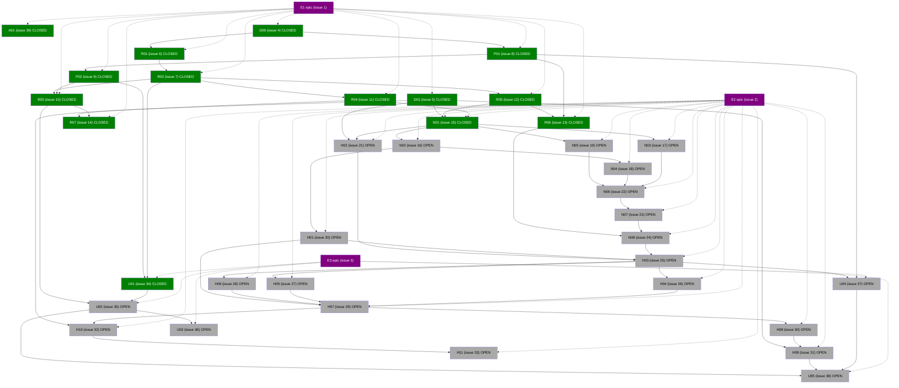
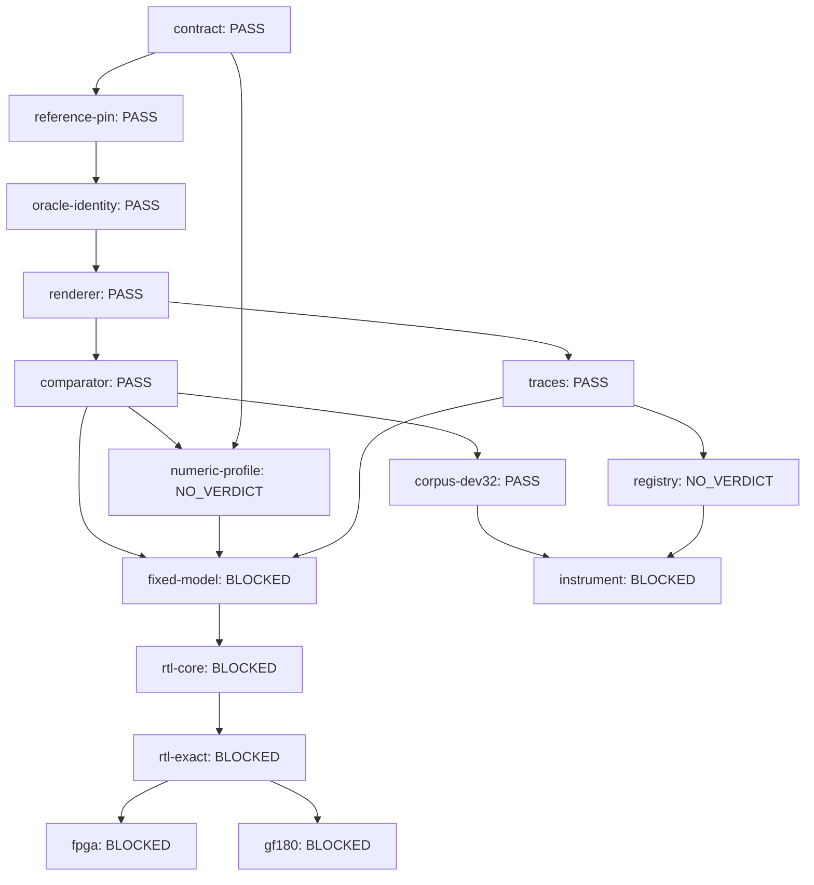

# gf180-dx7

A hardware canary for a DX7-compatible six-operator FM synthesis engine,
targeting the GlobalFoundries **gf180mcu** open PDK.

Proposed first product: a 16-note, six-operator, 32-algorithm DX7-compatible
engine that plays imported DX7 patches continuously, responds correctly to
velocity and performance controls, recalls a curated sound bank, and produces
verified digital audio. The RTL must match a frozen integer model exactly.

The initial executable comparison target is a pinned **Dexed Mark I**
configuration with documented differences. The RTL-vs-model comparison must
be exact; model-vs-reference comparisons use declared error budgets.

## Status

Planning. The executable backlog (35 dependency-linked tasks in three epics)
is tracked in GitHub issues. Architecture, reference stack, sound-library
strategy, verification contract, and starter briefs are defined in
[docs/dx7-chip-plan-v0.1-2026-09-20.md](docs/dx7-chip-plan-v0.1-2026-09-20.md).

Epics:

- **E1 — Reference and playable software** (#1): pinned reference renderer, SysEx
  codec, catalog, comparator, traces, compatibility registry.
- **E2 — Verified core and physical feasibility** (#2): integer models, operator
  and storage synthesis probes, fixed-model release, exact RTL, pin-level
  integration, FPGA capture, gf180 mapping.
- **E3 — Curated instrument** (#3): audition/recall tool, reviewed 32-patch bank,
  curated 128-patch bank, embedded host, end-to-end demonstration.

## Ground rules

Three judgments are kept separate throughout:

1. the RTL matches the model;
2. the model reproduces the chosen reference;
3. the instrument sounds good.

Passing one never establishes the others.

## Reuse vs build new

The DX7 DSP (six operators, DX envelopes, 32 algorithms, feedback) is built
new — no sibling implements it. What is reused from the Apache-2.0 sibling
repositories, each adoption with a provenance record and requalification:

- **gf180-parasynth / gf180-monosynth** (same design): SPI control link
  (`spi_ctl.v` + decision record 0007), I2S transmitter and pin-level
  decode harness, chip chassis (single-clock 256-cycle frame, tick/go,
  overrun), the N-channel shared-datapath precedent (`ladder_dp_n.v`,
  bit-exact at NCH=1/2/4/8), the working gf180mcu ORFS flow, ULX3S FPGA
  flow, and measured gf180mcu area calibrations.
- **gf180-torchsynth**: the pinning stack (commit-archive + SHA-256
  manifest + drift-rejecting verifier + runtime lock), non-perturbing
  trace capture, no-alignment paired comparator, case-registry/scorecard
  pattern, generic fixed-point primitives, and reuse-governance template
  (decision record 0005).
- **External GPL engines** (Dexed Mark I, VDX7, Hexter) are comparison
  oracles only — never copied into this Apache-2.0 repository.

## License

Apache License 2.0 (repo-level, per 2AMLogic convention). See
[LICENSE](LICENSE).

<!-- ISSUEDAG:BEGIN -->
## Backlog progress (issue DAG)

Generated from [spec/issue-dag-v1.json](spec/issue-dag-v1.json) by `tools/render_issue_dag.py` — do not hand-edit.

| CLOSED | OPEN | UNKNOWN | TOTAL |
| ---: | ---: | ---: | ---: |
| 14 | 22 | 0 | 36 |

These are issue states, not verification verdicts: a closed issue is not a capability claim, and no numeric PASS/coverage status is shown here. Evidence-derived capability status arrives with the fixed model and comparator (plan section 7).

<!-- ISSUEDAG:END -->

<!-- CAPABILITIES:BEGIN -->
## Capability status (evidence-derived)

Generated from [spec/capabilities-v1.json](spec/capabilities-v1.json) by `tools/compile_capabilities.py` — do not hand-edit. Evidence-derived node states; issue closure, file existence, and prose never establish a capability claim. Per-node claims, coverage, and controls: [docs/CAPABILITIES.md](docs/CAPABILITIES.md).

| PASS | FAIL | NOT_RUN | BLOCKED | NO_VERDICT | STALE |
| ---: | ---: | ---: | ---: | ---: | ---: |
| 7 | 0 | 0 | 6 | 2 | 0 |

<!-- CAPABILITIES:END -->
