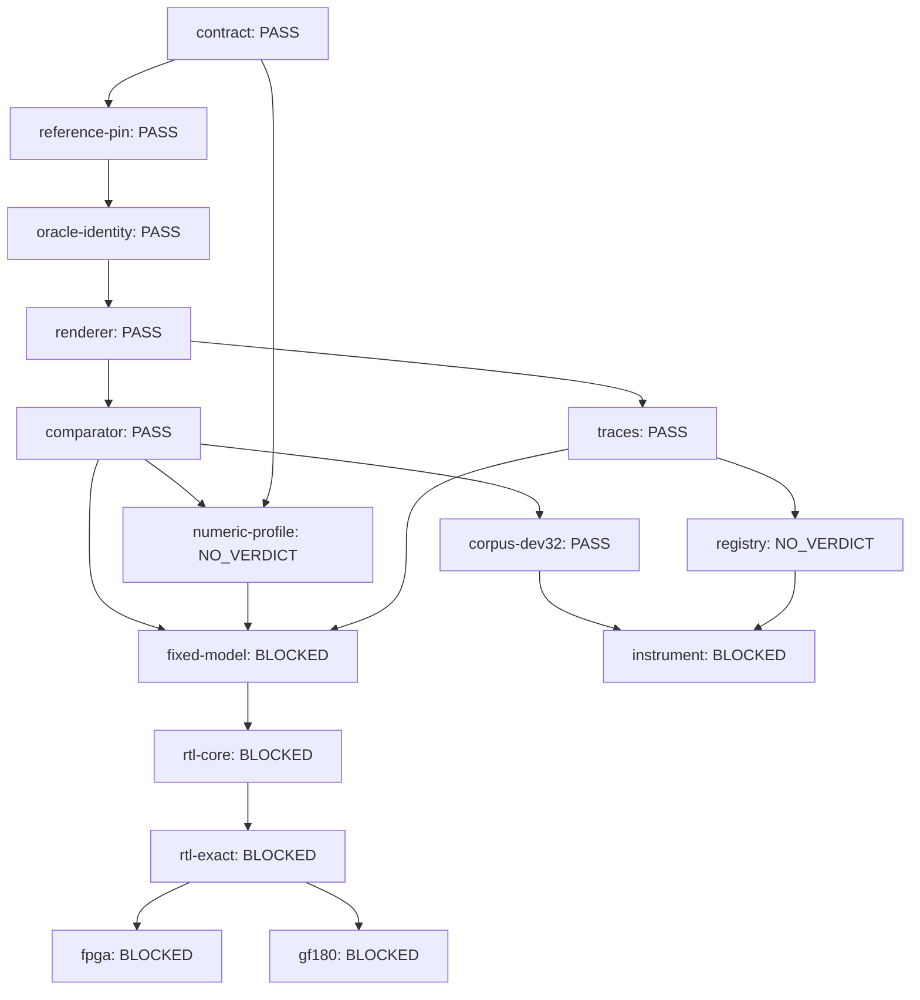

# Capability status (evidence-derived)

<!-- Generated by tools/compile_capabilities.py; edit spec/capabilities-v1.json and evidence/capabilities/, never this view. -->

Claim nodes for the DX7-compatible engine (plan section 7), stamped only by checks registered in `src/gf180_dx7/capabilities.py` (C01, issue #45). File existence, issue closure, tests counts, and prose never turn a node green: PASS requires a registered check that ran clean, content-hash coverage matching the current bytes of every input (including dirty and untracked files), and every required negative control recorded as executed AND detected. Any covered byte change is STALE; missing or undetected controls are NO_VERDICT, never PASS; unmet prerequisites are BLOCKED.

Regenerate with `python3 tools/compile_capabilities.py`; `--check` verifies these views without executing anything (CI staleness guard); `--strict` additionally requires every node PASS and is the future release gate (honestly red while nodes are NO_VERDICT). Evidence is produced only via `--stamp <node>`, which runs the registered command and the node's required controls.

| Node | Claim | State | Reason |
| --- | --- | --- | --- |
| contract | Frozen v1 product contract: spec/contract-v1.json and docs/DECISIONS-v1.md are in bidirectional lockstep (every DEC id present in both, claim language and omissions guarded) with recorded change control (D00, issue #4). | PASS | registered check ran clean, coverage is current, and every required negative control was recorded as detected |
| reference-pin | The pinned Dexed Mark I reference is exactly at the pinned commit with every pinned file hash and the toolchain matching, and drift is refused (R01, issue #6). Dexed agreement is never original-DX7 fidelity. | PASS | registered check ran clean, coverage is current, and every required negative control was recorded as detected |
| oracle-identity | The smoke fixture decodes via the P01 codec with the expected non-silent parameter set, and the external oracle binary matches its identity pin; an absent binary is a guarded NOT_RUN, never a pass (R02, issue #7). | PASS | registered check ran clean, coverage is current, and every required negative control was recorded as detected |
| renderer | The R01-gated harness re-renders the smoke fixture deterministically and the committed dry render cross-checks field-by-field (fixture, rates, counts, hashes, oracle pin) with the exact paired comparator verdict PASS (R02+R04, issues #7 and #11). | PASS | registered check ran clean, coverage is current, and every required negative control was recorded as detected |
| comparator | The exact paired comparator and its apparatus are qualified: analytic fixtures pass, every known-bad mutation class is caught with the right exit code, and invalid inputs (NaN, length, odd bytes) are never a match (R04, issue #11; committed qualification evidence). | PASS | registered check ran clean, coverage is current, and every required negative control was recorded as detected |
| corpus-dev32 | The 32-patch development manifest validates against the archive catalog (identity features, unique canonical hashes, render settings) and the committed render proof pins this manifest and catalog with non-silent sampled renders (R03, issue #10). | PASS | registered check ran clean, coverage is current, and every required negative control was recorded as detected |
| numeric-profile | Frozen numeric profile: integer formats, rounding, LUT and phase choices fixed in a machine-readable contract with content hashes (plan section 7, N-nodes). | NO_VERDICT | declared check is not registered; the node cannot pass until a check is registered, run, and stamped (engine: planned: numeric-profile qualification check; no registered check may stamp this node yet) |
| traces | Non-invasive trace capture from the pinned external oracle: traced and untraced renders are byte-identical, the versioned tap registry validates, and the trace gate holds per 64-sample block (R05, issue #12). | PASS | registered check ran clean, coverage is current, and every required negative control was recorded as detected |
| fixed-model | Frozen integer model reproduces the pinned software reference within declared error budgets, case coverage reported separately from agreement (plan section 7). | BLOCKED | declared check is not registered; the node cannot pass until a check is registered, run, and stamped (engine: planned: fixed-model qualification check; no registered check may stamp this node yet); prerequisite not demonstrated: numeric-profile=NO_VERDICT |
| rtl-core | Per-module RTL is sample-exact with the frozen integer model in simulation (plan section 7). | BLOCKED | declared check is not registered; the node cannot pass until a check is registered, run, and stamped (engine: planned: RTL module bench check; no registered check may stamp this node yet); prerequisite not demonstrated: fixed-model=BLOCKED |
| rtl-exact | Integrated RTL is sample-exact (bit-exact) with the frozen integer model end to end at 48 kHz (plan section 7). | BLOCKED | declared check is not registered; the node cannot pass until a check is registered, run, and stamped (engine: planned: integrated RTL exactness check; no registered check may stamp this node yet); prerequisite not demonstrated: rtl-core=BLOCKED |
| fpga | FPGA digital captures match the integrated model on the chosen board with alignment/calibration evidence (plan section 7). | BLOCKED | declared check is not registered; the node cannot pass until a check is registered, run, and stamped (engine: planned: FPGA capture check; no registered check may stamp this node yet); prerequisite not demonstrated: rtl-exact=BLOCKED |
| gf180 | gf180mcu synthesis/place-and-route with committed stage evidence from the pinned flow (plan section 7). | BLOCKED | declared check is not registered; the node cannot pass until a check is registered, run, and stamped (engine: planned: gf180 flow stage-evidence check; no registered check may stamp this node yet); prerequisite not demonstrated: rtl-exact=BLOCKED |
| registry | Complete directed compatibility registry over the corpus with per-patch codec/render outcomes (R06, issue #13). | NO_VERDICT | declared check is not registered; the node cannot pass until a check is registered, run, and stamped (engine: planned: registry qualification check (R06); no registered check may stamp this node yet) |
| instrument | The instrument is musically useful: audition/recall protocol over the curated bank with listening records (plan section 7; E3). | BLOCKED | declared check is not registered; the node cannot pass until a check is registered, run, and stamped (engine: planned: listening-protocol check; no registered check may stamp this node yet); prerequisite not demonstrated: registry=NO_VERDICT |

## contract — PASS

Frozen v1 product contract: spec/contract-v1.json and docs/DECISIONS-v1.md are in bidirectional lockstep (every DEC id present in both, claim language and omissions guarded) with recorded change control (D00, issue #4).

- Prerequisites: none.
- Check: `contract-tests-v1` — `python3 -m unittest tests.test_contract_v1 -v`.
- Covered inputs (plus the judge's own bytes): `docs/DECISIONS-v1.md`, `spec/contract-v1.json`.
- Required negative controls: none declared.
- Exclusions: No fidelity or hardware claim; contract text is not evidence of behavior; Drift guards (claim-language, omissions, bidirectional DEC ids) are embedded in the registered check itself; any covered-byte change is STALE.
- Evidence: `evidence/capabilities/contract.json`.

## reference-pin — PASS

The pinned Dexed Mark I reference is exactly at the pinned commit with every pinned file hash and the toolchain matching, and drift is refused (R01, issue #6). Dexed agreement is never original-DX7 fidelity.

- Prerequisites: contract.
- Check: `reference-pin-v1` — `python3 tools/verify_reference.py`.
- Covered inputs (plus the judge's own bytes): `reference/manifest.json`, `reference/oracle-identity.json`.
- Required negative controls: `pin-drift-refused` detects one mutated pinned byte and a wrong clone HEAD are both refused by the verifier (`python3 -m unittest tests.test_reference_manifest.TestPinnedTree`).
- Exclusions: No claim that Dexed equals an original DX7; No engine execution or audio claim; this is the pin, not a render; Environment-bound: requires the local clone; CI evaluates recorded evidence only.
- Evidence: `evidence/capabilities/reference-pin.json`.

## oracle-identity — PASS

The smoke fixture decodes via the P01 codec with the expected non-silent parameter set, and the external oracle binary matches its identity pin; an absent binary is a guarded NOT_RUN, never a pass (R02, issue #7).

- Prerequisites: reference-pin.
- Check: `render-selfcheck-v1` — `python3 tools/render_selfcheck.py`.
- Covered inputs (plus the judge's own bytes): `reference/fixtures/smoke/events.txt`, `reference/fixtures/smoke/voice.syx`, `reference/oracle-identity.json`.
- Required negative controls: `silent-substitution-refused` detects a silent render is rejected with no evidence written and a tampered oracle binary aborts identity verification (`python3 -m unittest tests.test_render_reference.TestNegativeControls`).
- Exclusions: No render reproducibility claim (renderer node owns that); No fidelity, listening, or hardware claim.
- Evidence: `evidence/capabilities/oracle-identity.json`.

## renderer — PASS

The R01-gated harness re-renders the smoke fixture deterministically and the committed dry render cross-checks field-by-field (fixture, rates, counts, hashes, oracle pin) with the exact paired comparator verdict PASS (R02+R04, issues #7 and #11).

- Prerequisites: oracle-identity.
- Check: `compare-evidence-v1` — `python3 tools/compare_evidence.py`.
- Covered inputs (plus the judge's own bytes): `reference/evidence/compare/reproducibility-r04.json`, `reference/evidence/smoke/render.f32`, `reference/evidence/smoke/render.json`, `reference/evidence/smoke/render.wav`.
- Required negative controls: `silent-substitution-refused` detects a silent render is rejected with no evidence written and a tampered oracle binary aborts identity verification (`python3 -m unittest tests.test_render_reference.TestNegativeControls`).
- Exclusions: Reference-vs-reference repeatability only; never model-vs-reference fidelity; Dry renders; no normalization or time-warping anywhere in the chain; No listening or musical-usefulness claim.
- Evidence: `evidence/capabilities/renderer.json`.

## comparator — PASS

The exact paired comparator and its apparatus are qualified: analytic fixtures pass, every known-bad mutation class is caught with the right exit code, and invalid inputs (NaN, length, odd bytes) are never a match (R04, issue #11; committed qualification evidence).

- Prerequisites: renderer.
- Check: `comparator-qualification-v1` — `python3 -m unittest tests.test_compare -v`.
- Covered inputs (plus the judge's own bytes): `reference/evidence/compare/qualification-r04.json`, `reference/evidence/compare/reproducibility-r04.json`.
- Required negative controls: `mutation-battery-caught` detects every injected mutation class (gain, shift, truncate, byte flip, NaN) is caught with the correct exit code by the CLI (`python3 -m unittest tests.test_compare.TestMutationBatteryCli`).
- Exclusions: Measurement discipline only; no fidelity verdict about any engine; No averaging of unlike units into a quality score; coverage stays separate from agreement.
- Evidence: `evidence/capabilities/comparator.json`.

## corpus-dev32 — PASS

The 32-patch development manifest validates against the archive catalog (identity features, unique canonical hashes, render settings) and the committed render proof pins this manifest and catalog with non-silent sampled renders (R03, issue #10).

- Prerequisites: comparator.
- Check: `dev32-validation-v1` — `python3 tools/validate_dev32.py --out build/capabilities/dev32-renderproof.json`.
- Covered inputs (plus the judge's own bytes): `corpus/archive-catalogs/alltheweb-catalog.json`, `corpus/dev32-renderproof.json`, `corpus/dev32.json`.
- Required negative controls: `mutated-manifest-rejected` detects a mutated manifest (foreign hash, duplicate, missing events/settings) is rejected by validation (`python3 -m unittest tests.test_dev32.TestNegativeControls`).
- Exclusions: Catalog rights: archive bytes are never redistributed; selection only; No preset-quality or musical-usefulness claim; Full-32 render gate is recorded NOT_RUN in the proof (sampled proof only).
- Evidence: `evidence/capabilities/corpus-dev32.json`.

## numeric-profile — NO_VERDICT

Frozen numeric profile: integer formats, rounding, LUT and phase choices fixed in a machine-readable contract with content hashes (plan section 7, N-nodes).

- Prerequisites: comparator, contract.
- Check: not registered (planned: numeric-profile qualification check; no registered check may stamp this node yet).
- Covered inputs (plus the judge's own bytes): none declared.
- Required negative controls: none declared.
- Exclusions: Declared, not evidenced: stays NO_VERDICT until the profile exists, is registered, and is stamped; No float-vs-fixed agreement claim exists today.
- Evidence: none; a planned node must not carry an evidence record

## traces — PASS

Non-invasive trace capture from the pinned external oracle: traced and untraced renders are byte-identical, the versioned tap registry validates, and the trace gate holds per 64-sample block (R05, issue #12).

- Prerequisites: renderer.
- Check: `trace-capture-v1` — `python3 tools/capture_trace.py --traces-dir build/capabilities/traces`.
- Covered inputs (plus the judge's own bytes): `reference/fixtures/smoke/events.txt`, `reference/fixtures/smoke/voice.syx`, `reference/oracle-identity.json`, `reference/trace-registry.json`.
- Required negative controls: `perturbing-stub-rejected` detects a stub oracle whose trace perturbs the PCM is rejected with no artifacts written (`python3 -m unittest tests.test_trace_capture.TestStubGate`).
- Exclusions: Proves non-perturbation of the oracle, not correctness of captured values; No model equivalence or RTL claim; Fresh traces are written to build/ (untracked); committed inputs are what coverage pins.
- Evidence: `evidence/capabilities/traces.json`.

## fixed-model — BLOCKED

Frozen integer model reproduces the pinned software reference within declared error budgets, case coverage reported separately from agreement (plan section 7).

- Prerequisites: comparator, numeric-profile, traces.
- Check: not registered (planned: fixed-model qualification check; no registered check may stamp this node yet).
- Covered inputs (plus the judge's own bytes): none declared.
- Required negative controls: none declared.
- Exclusions: Declared, not evidenced: stays NO_VERDICT until the model lands and is stamped; Budgets are never inferred from RTL or reference self-agreement.
- Evidence: none; a planned node must not carry an evidence record

## rtl-core — BLOCKED

Per-module RTL is sample-exact with the frozen integer model in simulation (plan section 7).

- Prerequisites: fixed-model.
- Check: not registered (planned: RTL module bench check; no registered check may stamp this node yet).
- Covered inputs (plus the judge's own bytes): none declared.
- Required negative controls: none declared.
- Exclusions: Declared, not evidenced: stays NO_VERDICT until RTL exists and is stamped; No physical timing claim.
- Evidence: none; a planned node must not carry an evidence record

## rtl-exact — BLOCKED

Integrated RTL is sample-exact (bit-exact) with the frozen integer model end to end at 48 kHz (plan section 7).

- Prerequisites: rtl-core.
- Check: not registered (planned: integrated RTL exactness check; no registered check may stamp this node yet).
- Covered inputs (plus the judge's own bytes): none declared.
- Required negative controls: none declared.
- Exclusions: Declared, not evidenced: stays NO_VERDICT until integration lands and is stamped; No FPGA or silicon execution claim.
- Evidence: none; a planned node must not carry an evidence record

## fpga — BLOCKED

FPGA digital captures match the integrated model on the chosen board with alignment/calibration evidence (plan section 7).

- Prerequisites: rtl-exact.
- Check: not registered (planned: FPGA capture check; no registered check may stamp this node yet).
- Covered inputs (plus the judge's own bytes): none declared.
- Required negative controls: none declared.
- Exclusions: Declared, not evidenced: stays NO_VERDICT until board capture evidence is stamped; No board decision yet; analog audio out of scope for this node.
- Evidence: none; a planned node must not carry an evidence record

## gf180 — BLOCKED

gf180mcu synthesis/place-and-route with committed stage evidence from the pinned flow (plan section 7).

- Prerequisites: rtl-exact.
- Check: not registered (planned: gf180 flow stage-evidence check; no registered check may stamp this node yet).
- Covered inputs (plus the judge's own bytes): none declared.
- Required negative controls: none declared.
- Exclusions: Declared, not evidenced: stays NO_VERDICT until ASIC work starts; No synthesis, P&amp;R, signoff, or silicon claim exists today.
- Evidence: none; a planned node must not carry an evidence record

## registry — NO_VERDICT

Complete directed compatibility registry over the corpus with per-patch codec/render outcomes (R06, issue #13).

- Prerequisites: traces.
- Check: not registered (planned: registry qualification check (R06); no registered check may stamp this node yet).
- Covered inputs (plus the judge's own bytes): none declared.
- Required negative controls: none declared.
- Exclusions: Declared, not evidenced: stays NO_VERDICT until R06 registers and stamps a check; No per-patch verdict exists today.
- Evidence: none; a planned node must not carry an evidence record

## instrument — BLOCKED

The instrument is musically useful: audition/recall protocol over the curated bank with listening records (plan section 7; E3).

- Prerequisites: corpus-dev32, registry.
- Check: not registered (planned: listening-protocol check; no registered check may stamp this node yet).
- Covered inputs (plus the judge's own bytes): none declared.
- Required negative controls: none declared.
- Exclusions: Declared, not evidenced: numeric agreement never establishes musical usefulness; listening records do; Stays NO_VERDICT until a listening protocol is registered and stamped.
- Evidence: none; a planned node must not carry an evidence record
